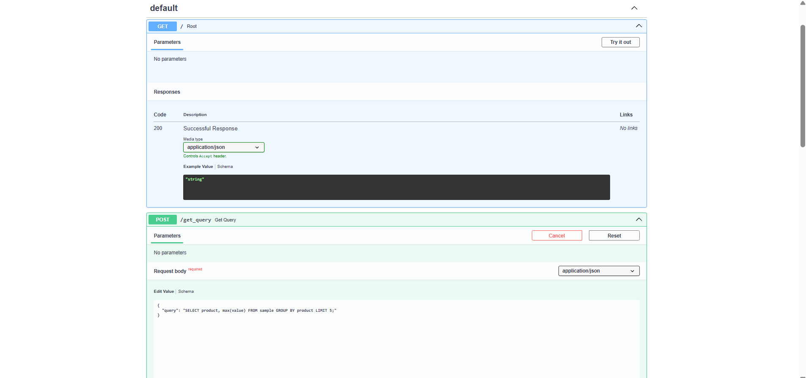
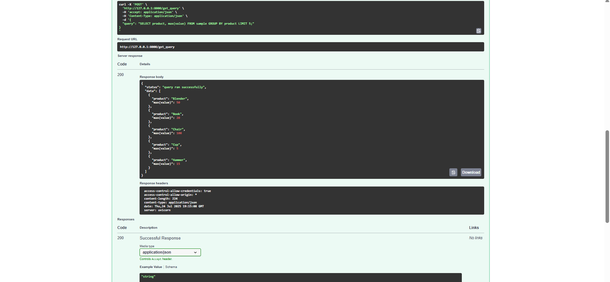
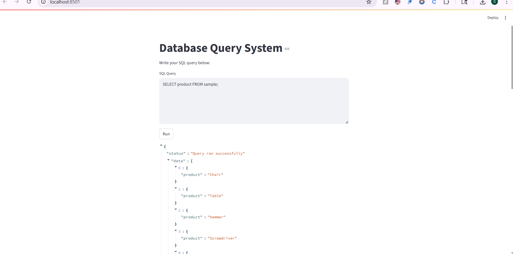

# Query System 
A lightweight Query System that allows users to create their own SQLite database and run SQL queries on it through a simple web interface built with **FastAPI (Backend)** and **Streamlit (Frontend)**.

---

## 🚀 Features

- ✍️ Create your own database and populate it with sample data  
- 🔍 Run custom SQL queries through the browser  
- ⚙️ Built with FastAPI and Streamlit for a responsive full-stack experience  
- 🧪 Error handling for invalid queries or bad requests  
- 🌐 Fully local — no external database or server dependencies  

---

## 🛠️ Tech Stack

| Layer       | Technology    |
|-------------|----------------|
| Frontend    | Streamlit      |
| Backend     | FastAPI        |
| Database    | SQLite         |
| Others      | SQLAlchemy, Python `requests`, Uvicorn |

---

## 📸 Proof of Execution

### 🖥️ FastAPI Backend

### 🎨 Streamlit Frontend

---

## ⚙️ How to Run Locally

1. **Clone the repo**
   git clone https://github.com/suyasha-metkar/Query-System.git
   cd Query-System
2. Install dependencies
   pip install -r requirements.txt

3. Create sample database
   python create_sample_db.py

4.Start FastAPI backend
   uvicorn main:app --reload
Visit: http://127.0.0.1:8000/docs on web browser to check FastAPI

5. Start Streamlit frontend
   streamlit run UserInterface.py
Visit http://localhost:8501 on web browser to run query on frontend

